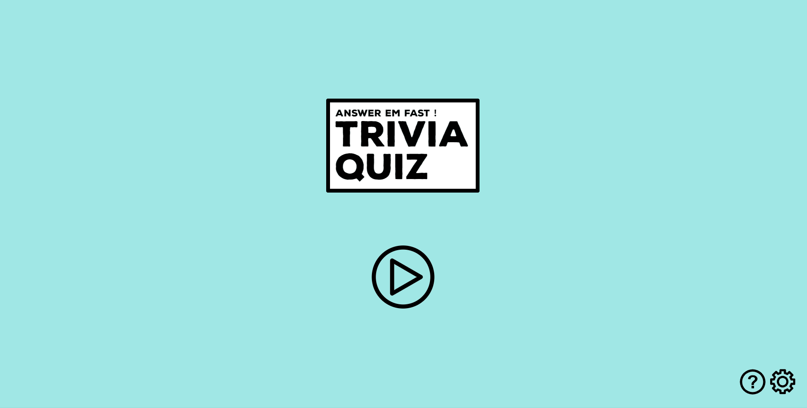
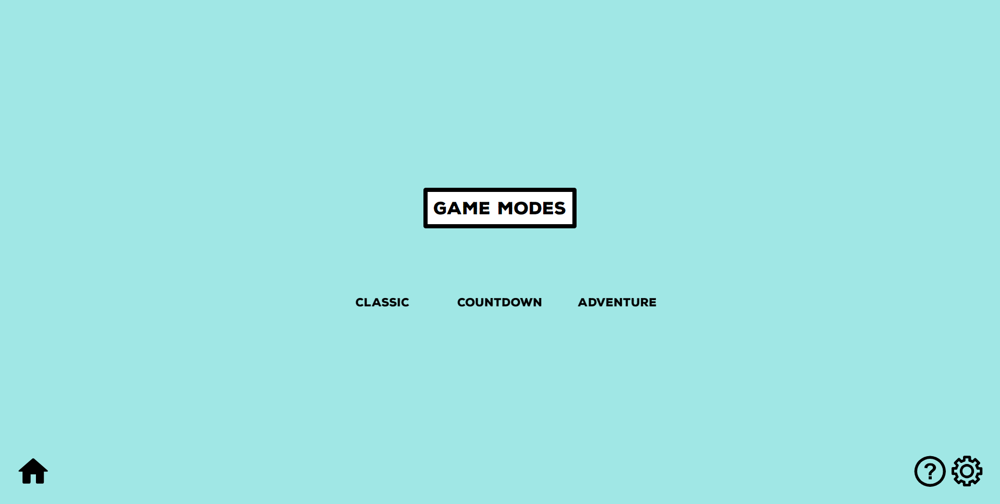
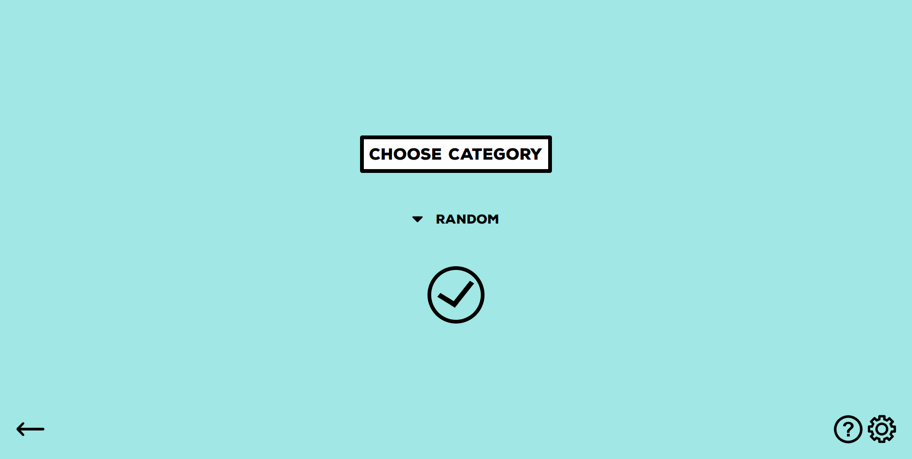
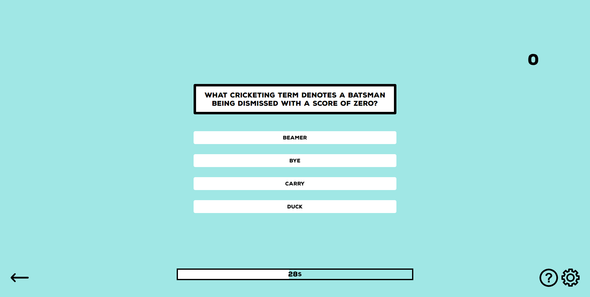
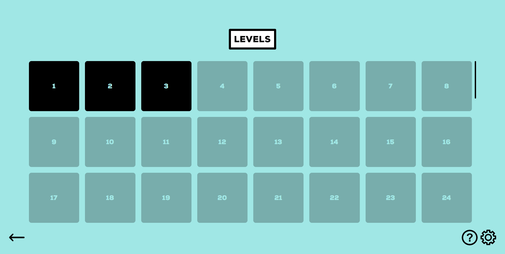
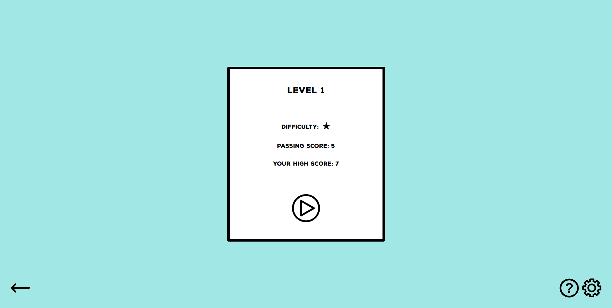
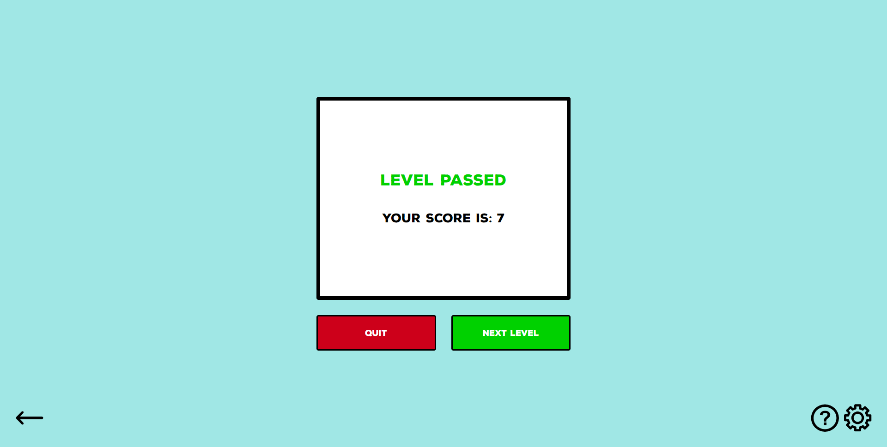

# Project Overview

## Table of contents

-  [Overview](#overview)
   -  [Features](#features)
   -  [UI Demo](#ui-demo)
   -  [Screenshots](#screenshots)
   -  [Links](#links)
-  [My process](#my-process)
   -  [Built with](#built-with)
   -  [What I learned](#what-i-learned)
   -  [Continued development](#continued-development)
   -  [Useful resources](#useful-resources)
-  [Author](#author)

## Overview

### Features

Users should be able to:

- Answer a variety of trivia questions from different categories
- Select categories for the trivia questions
- Play 3 different game modes: Classic, countdown, and adventure
- Customize the sound and background settings
- Track progress of completed levels in adventure mode

### UI Demo

### Screenshots

### Links

- Repository URL: [Github Respository](https://github.com/jordan-na/trivia-quiz.git)
- Live Site URL: [Hosted on Github Pages](https://jordan-na.github.io/trivia-quiz/)

## My process

### Built with

- Semantic HTML5 markup
- CSS custom properties
- Flexbox
- Grid
- Vanilla JS
- [Open Trivia Database](https://opentdb.com)

### Modules Overview

- **Main Components**:
   - ***app.js***: Calls the main functions to start/initialize the application
   - ***event-handler.mjs***: Adds the event listeners and callback methods to the DOM
   - ***TriviaGame.mjs***: A class that contains methods to update the internal state of a trivia game. This includes the questions, current question, the score, number of questions wrong, etc.
   - ***TriviaGameCountdown.mjs***: A subclass of TriviaGame that provides additional methods to facilitate the state/behaviour of a countdown game.
   - ***TriviaGameLevel.mjs***: A subclass of TriviaGame that provides additional methods to facilitate the state/behaviour of an adventure game.
   - ***ui-controller.mjs***: Responsible for updating the UI
   - ***game-controller.mjs***: "Controls" the game by determining which game mode is selected and how the UI is going to update according to the internal changes of the game state
   - ***api-handler***: Makes the API calls to retrieve the question data from the trivia database
   - ***audio-controller***: Controls the audio of the game
   - ***background-controller***: Changes the background of the game
- **Other Components**
   - ***animation-delay-controller***: Sets up the animation delays for the level grid
   - ***levels.mjs***: Contains all the trivia data for the adenture levels to be loaded into memory during runtime
   - ***utils.mjs***: Contains general utility methods

### What I learned

-  Non-technical skills:
   -  Brainstorming
      -  Asking what the user would want for a good UX
      -  Deciding on theme colors
      -  Deciding on font
      -  Visualizing animations
      -  Determing what assets are needed (e.g. images, svg)
   -  Organization
      -  Creating a project timeline
      -  Deciding how to organize code into different modules
      -  Organizing files into a file structure that is easy to understand

-  Technical skills:
   -  Working with API
      -  Making api requests
      -  JSON
      -  Multiple requests with custom queries
   -  UI:
      -  Using raw CSS to implement a minimal UI
      -  Animations
      -  Using [vivus.js](https://maxwellito.github.io/vivus/) for svg animations
      -  Using screenspace and positioning elements wisely
   -  Game logic:
      -  Using javascript classes to represent the different types of trivia games
      -  Combining UI behaviour with the game state to create a dynamic interface
      -  Make api calls in realtime to provide the data for the game

### Continued development

-  I will continue to make web projects and explore other venues of software engineering
-  Learn an animation library such as anime.js or velocity.js
-  Get better at problem solving and abstract thinking
-  Reflect on the things I could have done better and learn from mistakes

### Useful resources

-  [MDN](https://reactjs.org/) - This helped me by acting as a reference for the react library
-  [Open Trivia Database](https://opentdb.com) - The API used for trivia questions
-  [vivus.js](https://maxwellito.github.io/vivus/) for svg animations

## Author

-  Name: Jordan Na
-  Website - [Github Profile](https://github.com/jordan-na)
-  Frontend Mentor - [@jordan-na](https://www.frontendmentor.io/profile/jordan-na)
-  Email - jordster02@gmail.com